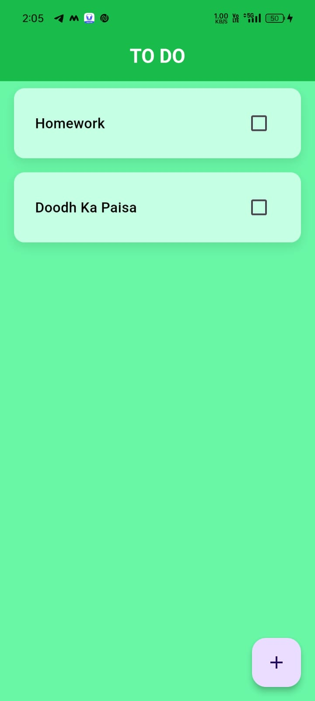
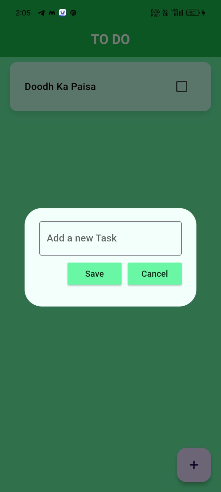
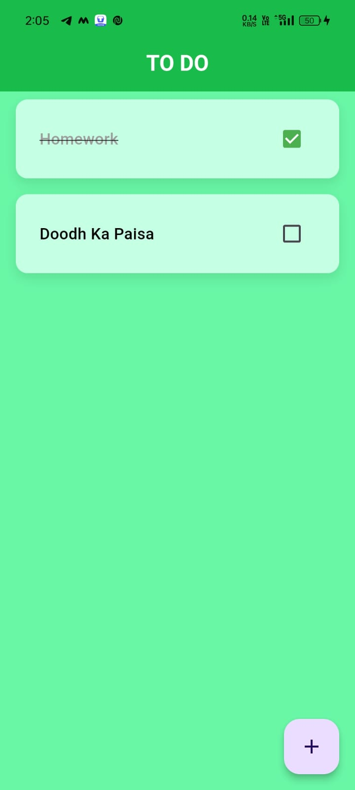
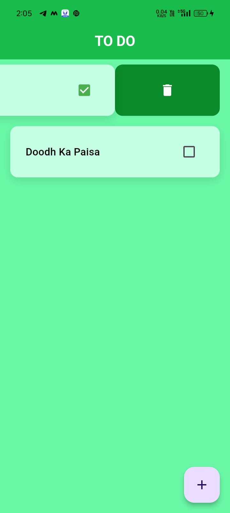

# 📋 ToDoApp

A simple and intuitive To-Do List application built with Flutter and Hive for local storage.

## ✨ Features

- ➕ Add new tasks
- ✅ Mark tasks as complete
- 🗑️ Delete tasks
- 📂 Persist tasks locally using Hive

## 📸 Screenshots

<p align="center">
  
  
  
  
</p>


## 🛠️ Installation

To run this project locally, follow these steps:

1. **Clone the repository:**

   ```bash
   git clone https://github.com/ishansasane/todoapp.git
   ```
   ```bash
   cd todoapp
   ```
   ```bash
   flutter pub get
   ```
   ```bash
   flutter run
   ```

